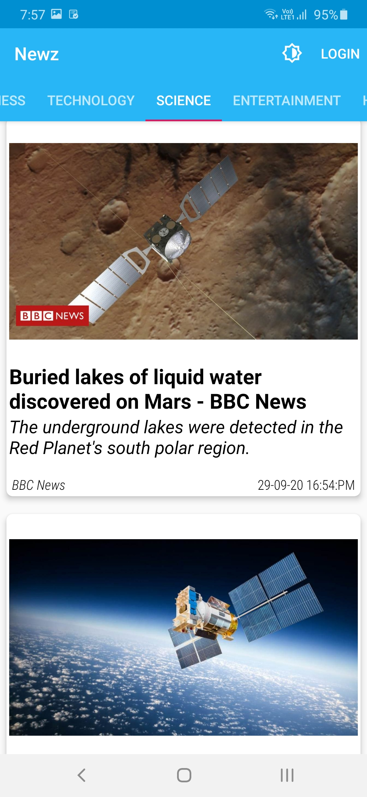

# Newz

  

Newz is a simple news application showing MVVM architecture, Room persistence library, LiveData, and Hilt-Dagger implementation.
 
This app provides user with top headlines and news of different categories such as Business, Technology, Sports, Science, Health.
 
It uses NewsApi to fetch news.

## Screenshots
  

## Tech
- Android JetPack Components
  - LiveData 
  - Lifecycle 
  - ViewModel 
  - Room Persistence
- Hilt for dependency injection
- ViewPager2
- Retrofit
- Glide
- Firebase

## Architecture
This app is based on MVVM architecture and a repository pattern.

